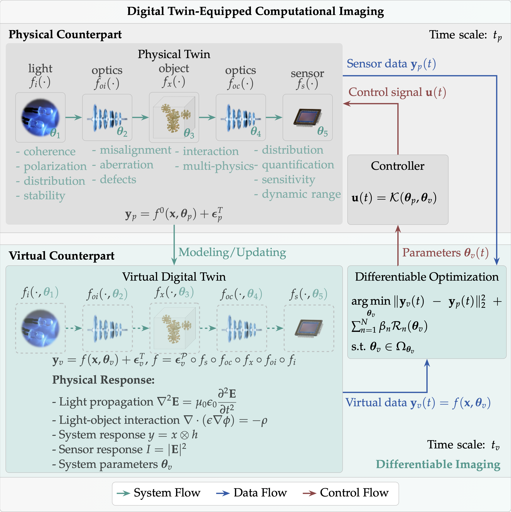

<h2 class="section-title">Differentiable ImagingTM</h2>

  A paradigm for resilient computational imaging

 
<nav class="text-center" style="width: 100%; font-size:1.2em;">
📄 <b><a href="https://onlinelibrary.wiley.com/doi/full/10.1002/apxr.202200118">Differentiable Imaging: A New Tool for Computational Optical Imaging</a></b>, <em>Advanced Physics Research</em>, 2023</nav>
<nav class="text-center">
  <a href="https://ni-chen.github.io/">Ni Chen</a>1,2, 
  <a href="http://www.holoddd.com/">Liangcai Cao</a>3, 
  <a href="https://www.ece.vt.edu/people/profile/poon">Ting-Chung Poon</a>4, 
  <a href="http://oeqelab.snu.ac.kr/">Byoungho Lee</a>5, 
  <a href="https://www.eee.hku.hk/~elam">Edmund Y. Lam</a>6
</nav>

  
1King Abdullah University of Science and Technology

  
2University of Arizona

  
3Tsinghua University

  
4Virginia Tech

  
5Seoul National University

  
6The University of Hong Kong

<nav class="text-center" style="width: 100%; font-size:1.2em;"> 📄 <b><a href="https://spj.science.org/doi/10.34133/adi.0117">Differentiable Imaging: Progress, Challenges, and Outlook</a></b>, <em>Advanced Devices & Instrumentation</em>, 2025 </nav>
<nav class="text-center">
  <a href="https://ni-chen.github.io/">Ni Chen</a>1,
  <a href="http://www.davidbrady.net/">David J. Brady</a>2,
  <a href="https://www.eee.hku.hk/~elam">Edmund Y. Lam</a>1
</nav>

  
1The University of Hong Kong

  
2University of Arizona

## Abstract

Differentiable Imaging is a framework that seamlessly integrates optical hardware with computational algorithms to address critical challenges in traditional computational imaging. By leveraging differentiable programming, this approach enables end-to-end optimization of the whole imaging systems while accounting for real-world physical imperfections. The differentiable imaging framework leads to simplified hardware designs, enhanced imaging performance, and resilience imaging across diverse imaging modalities. The differentiable linkage among all system components ultimately enables genuine co-design in computational imaging.

## Introduction

<!-- |  |
| :----------------------------------------------------------: |
| Uncertainties that lead to mismatch between real systems and numerical modeling. | -->

|  |
| :----------------------------------------------------------: |
| Typical Uncertainties that lead to mismatch. |

Computational imaging has made significant advances but continues to face substantial challenges from system uncertainties. These uncertainties can be categorized into five key areas:

* **System Imperfections:** Deviations in hardware component specifications and performance
* **Mechanical Issues:** Physical misalignments, vibrations, and structural instabilities  
* **Sensor Limitations:** Electronic noise, quantization errors, and detector nonlinearities
* **Operational Variability:** Epistemic and aleatory uncertainties arising from dynamic environmental conditions
* **Numerical Errors:** Computational approximations and discretization effects in modeling

Effective co-design requires multi-variable optimization with accurate mathematical modeling of real systems. These uncertainties not only hinder precise numerical modeling but also complicate inverse problem solving, creating a fundamental bottleneck in computational imaging advancement.

## Technical Framework

|  |
| :----------------------------------------------------------: |
| Comparison of Computational Imaging and Differentiable Imaging. |

Differentiable imaging [^1] fundamentally redefines co-design by integrating physically accurate models within machine learning architectures for comprehensive end-to-end optimization. This framework specifically targets uncertainties that cause critical mismatches between real-world systems and their numerical representations. Through differentiable programming and automatic differentiation, these uncertainties are explicitly modeled and their impacts systematically mitigated.

By leveraging differentiable programming, differentiable imaging offers an elegant solution to the limitations of conventional computational imaging. Rather than pursuing increasingly complex yet cumbersome physical models, differentiable imaging fundamentally reconceptualizes the imaging process. It transforms the traditional encoding model $y=f(x)$  into a more comprehensive formulation $y=f(x, \theta)$, where $\theta$ represents a parameter set specifically designed to address and compensate for mismatches between physical systems and numerical models.

The complete forward model captures the entire imaging pipeline through a series of interconnected transformations:

$$\begin{equation}
y = f(x, \theta), \qquad f = f_{noise} \circ f_c \circ f_{oc} \circ f_x \circ f_{oi} \circ f_i,
\end{equation}$$

where the function composition operator $\circ$ connects each system component, and $\theta = \{ \theta_c, \theta_{oc}, \ldots \}$ encompasses all system parameters. Each component corresponds to specific physical processes within the imaging system, from illumination characteristics through object interactions to sensor behavior and noise sources.

This comprehensive forward model enables the formulation of an elegant inverse problem that simultaneously optimizes system parameters while reconstructing images:

$$\begin{equation}
x^*, \theta^* = \text{argmin}_{x, \theta} \mathcal{L}(f(x, \theta), y) + \sum_{n=1}^N \beta_n \mathcal{R}_n(x) \\ 
s.t. \quad x \in \Omega_x, \theta \in \Omega_{\theta}
\end{equation}$$

Here, $\mathcal{L}(f(x, \theta), y)$ represents the fidelity term that quantifies the discrepancy between the model predictions and measured data. While the ${\ell_2}$ loss $\mathcal{L}(f(x, \theta), y) = \|f(x, \theta) - y\|^2$ is commonly used due to its mathematical tractability and compatibility with Gaussian noise assumptions, the selection of an appropriate fidelity function depends critically on the specific imaging conditions and noise characteristics.

The framework introduces two primary innovations:

1. **System Imperfection Modeling:** Direct integration of hardware imperfections into imaging models (represented as $f(x,\theta)$ where $\theta$ encapsulates uncertainty parameters)
2. **Differentiable Optimization:** Implementation of inverse problem solving using differentiable optimization algorithms, enabling gradient-based optimization across the entire imaging pipeline

This integrated methodology facilitates closed-loop optimization, resulting in robust, high-performance imaging systems that maintain effectiveness despite real-world imperfections.

## Research Achievements

Since 2021, our exploration of differentiable imaging across various domains has led to significant advancements:

| Techniques                                     | Uncertainties                                                | Achievements                                                 |
| ---------------------------------------------- | ------------------------------------------------------------ | ------------------------------------------------------------ |
| **Differentiable Holography**[^6],[^5]         | Defocus distance; Complex light-wave interaction;            | Single-shot wavefield imaging; high-density Single-shot 3D PIV |
| **Differentiable Lensless Imaging**[^4]        | Sensor scanning positions; defocus distances;                | Pixel-super resolution; High-performance imaging; Compact and cost-effective hardware |
| **Uncertainty-Aware Fourier Ptychography**[^3] | Modelable: misalignment, element aberrations;  Statistical: noise, low quality data | Simplified measurements; resolution beyond traditional physical limits; expanded system functions |

Our research has revealed three fundamental principles:

1. **Precision in Modeling:** The accuracy of optical system modeling is paramount to successful implementation
2. **Physics-Grounded Algorithms:** Algorithms rooted in fundamental physical principles ensure computational efficiency, system robustness, and result interpretability
3. **System-Algorithm Synergy:** Effective interplay between physical hardware and computational models is crucial for both imaging quality and optimal system design

Powered by differentiable programming, differentiable imaging has emerged as a pivotal force in computational imaging—its significance far transcends uncertainty-aware computation. Acting as a unifying nexus, it enables seamless integration across the core components of computational imaging: it harmonizes hardware design with software reconstruction, ensuring a fluid transition from physical devices to algorithmic implementations; it connects numerical optimization and machine learning, fueling continuous advancements in algorithm performance; it bridges mathematical theory, information theory, and physical realization, translating abstract concepts into practical, high-impact technical solutions; and it drives deep integration across optics, material science, and computational sciences, dismantling long-entrenched disciplinary silos. Through this interconnected framework, all components mutually reinforce and co-evolve, ultimately realizing the long-pursued goal of global optimization in computational imaging.

|  |
| :----------------------------------------------------------: |
| Digital Twin equipped Computational Imaging. |

The potential of differentiable imaging extends well beyond its current applications. Future advancements may include integration with digital twin technology and contributions to AI for Science initiatives [^2], thereby unlocking new paradigms for scientific discovery and technological innovation.

## Related Publications

[^1]: Ni Chen, Liangcai Cao, Ting-Chung Poon, Byoungho Lee, Edmund Y. Lam, "[Differentiable Imaging: A New Tool for Computational Optical Imaging](https://onlinelibrary.wiley.com/doi/full/10.1002/apxr.202200118)," Advanced Physics Research, 2023.

[^2]: Ni Chen, David J. Brady, Edmund Y. Lam, "[Differentiable Imaging: progress, challenges, and outlook](https://spj.science.org/doi/10.34133/adi.0117)," Advanced Devices & Instrumentation, 2025.

[^3]: Ni Chen, Yang Wu, Chao Tan, Liangcai Cao, Jun Wang, Edmund Y. Lam, "[Uncertainty-Aware Fourier Ptychography](https://doi.org/10.1038/s41377-025-01915-w)," Light: Science & Applications, 2025.

[^4]: Ni Chen, Edmund Y. Lam, "[Differentiable pixel-super-resolution lensless imaging](https://doi.org/10.1364/OL.552086)," Optics Letters, 2025.

[^5]: Yang Wu, Jun Wang, Sigurdur Thoroddsen, Ni Chen*, "[Single-Shot High-Density Volumetric Particle Imaging Enabled by Differentiable Holography](https://ieeexplore.ieee.org/abstract/document/10660564)," IEEE Transactions on Industrial Informatics, 2024.

[^6]: Ni Chen, Congli Wang, Wolfgang Heidrich, "[∂H: Differentiable Holography](https://onlinelibrary.wiley.com/doi/abs/10.1002/lpor.202200828)," Laser & Photonics Reviews, 2023.