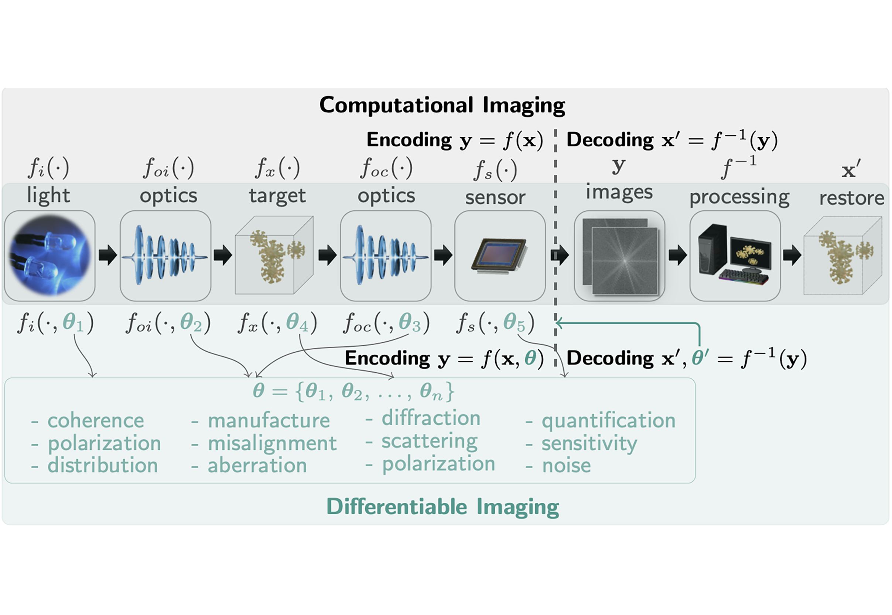
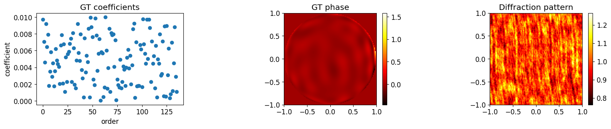
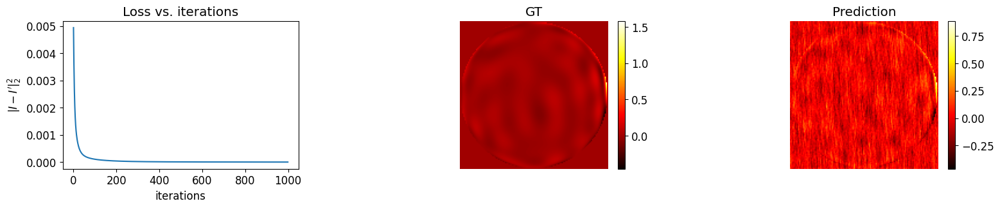
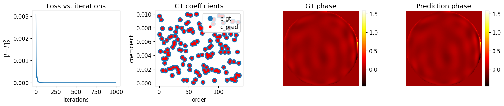

</br>

Computational imaging has made significant advancements in recent years, but faces limitations due to the restrictions imposed by traditional computational techniques. Differentiable programming offers a promising solution by combining the strengths of classical optimization and deep learning. By integrating physics into the modeling process, **differentiable imaging** [@Chen2023APR; @Chen2025ADI;@Chen2025SPIE] - which employs differentiable programming in computational imaging - has the potential to overcome challenges posed by sparse, incomplete, and noisy data. This could be a key factor in advancing the field of computational imaging and its various applications.

Modeling the physics accurately is of great importance in differentiable imaging. Since many computational imaging techniques rely on ray tracing and diffraction [@Chen2022OE], we have developed both a **ray-tracing differentiable framework** [@Wang2022TCI] and a **diffraction-based differentiable framework** [@Chen2023LPOR]. These frameworks have applications in self-calibration, end-to-end lens design [@Wang2022TCI], metrology [@Wang2021OE], holography ($\partial {H}$) [@Chen2023LPOR;@Wu2023DH], lensless imaging [@Chen2025OL], Phase Retrieval [@JWang2025OLT;@Wang2024COSI;@Wang2024COSI], Fourier Ptychographic Microscopy [@Wang2024COSI;@Chen2024ODF;@Chen2024FiO;@Wu2025LSA] and more. The differentiable ray-tracing framework has proven to be highly efficient and enables easy incorporation of neural networks, thereby promoting lens design.

Please refer to the paper to find how this **differentiable imaging** [@Chen2023APR;@Chen2025ADI] enables more efficient and effective imaging, and our insights on its potential impact in the computational imaging field.



## Example 1: How to get the derivatives in PyTorch

This is the code of the example in Fig. 3. We calculate $\frac{\partial y}{\partial x_1}$ and $\frac{\partial y}{\partial x_2}$ at $(x_1, x_2)=(2,1)$ for function of $y = \sin(x_1) + x_1 \times x_2$

``` python
import torch

x1 = torch.tensor([2.])
x2 = torch.tensor([1.])

x1.requires_grad = True
x2.requires_grad = True

vm = x1
v0 = x2
v1 = torch.sin(vm)
v2 = vm * v0
v3 = v1 + v2
y = v3

vm.retain_grad()
v1.retain_grad()
v2.retain_grad()
v3.retain_grad()

y.backward()

print("partial v3: " + str(v3.grad.item()))
print("partial v2: " + str(v2.grad.item()))
print("partial v1: " + str(v1.grad.item()))
print("partial v0: " + str(v0.grad.item()))
print("partial vm: " + str(vm.grad.item()))
```

The output is

``` bash
partial v3: 1.0
partial v2: 1.0
partial v1: 1.0
partial v0: 2.0
partial vm: 0.5838531255722046
```

## Example 2: Optimize a phase from a diffraction pattern

Suppose a diffraction pattern $y=\mathcal{P} \lbrace \exp( j \phi ) \rbrace$, we would like to get $\phi$ from $y$. We conduct two approaches: 1. Optimize $\phi$ from $y$ 2. Optimize Zernike coefficients $c$ from $y$

### Generate a diffraction image from an phase abberation

``` python
import torch
from matplotlib import pyplot as plt
import torch.optim as optim
from torch import nn

from function.diffraction import *
from function.util import *

from function.zernike import RZern

torch.manual_seed(0)

############################### Generate Zernike phase ################################
cart = RZern(15)   
Ny, Nx = 128, 128
xx, yy = np.meshgrid(np.linspace(-1.0, 1.0, Nx), np.linspace(-1.0, 1.0, Ny))
cart.make_cart_grid(xx, yy)

c_gt = 0.01 * torch.rand(cart.nk, dtype=torch.double)    # ground truth Zernike coefficients 
phi_gt_2d = cart.eval_grid(c_gt, matrix=True).transpose(0, 1).reshape((Nx, Ny))   # ground truth phase 

######################### calculate diffraction intensity from phase ########################
params = PropParam()
params.wavelen = torch.tensor([500e-9])
params.pps = torch.tensor([5e-6])
params.z = torch.nn.Parameter(torch.tensor([100e-3], dtype=torch.float32))
params.Nx, params.Ny = Nx, Ny
params = prop_kernel(params)

def forward_model_phase(phi):
    field = torch.exp(1j*phi)
    diffraction_pattern = forward_wave_prop(field, params).abs()**2

    return diffraction_pattern

diffraction_pattern = forward_model_phase(phi_gt_2d)

# display images
plt.rcParams.update({'font.size': 12})
plt.figure(figsize=(18, 3))
plt.subplots_adjust(wspace=0.4, hspace=0)

plt.subplot(131)
plt.plot(c_gt, 'o')
plt.title('GT coefficients')
plt.xlabel('order')
plt.ylabel('coefficient')

plt.subplot(132)
plt.imshow(phi_gt_2d.detach(), origin='lower', extent=(-1, 1, -1, 1), cmap='hot')
plt.colorbar(fraction=0.046, pad=0.04)
plt.title('GT phase')

plt.subplot(133)
plt.imshow(diffraction_pattern.detach(), origin='lower', extent=(-1, 1, -1, 1), cmap='hot')
plt.colorbar(fraction=0.046, pad=0.04)
plt.title('Diffraction pattern')

plt.show()
```

Outputs:



### Optimize phase directly

``` python
phi_pred = nn.Parameter(0.05*torch.rand([Nx, Ny], dtype=torch.double, requires_grad=True))

loss_hist = []
lr = 0.005
optimizer = optim.Adam([phi_pred], lr=lr)
for iter in range(1000):
    optimizer.zero_grad()     # Essential for update the derivatives

    I_prime = forward_model_phase(phi_pred)
    loss = torch.mean((I_prime - diffraction_pattern)**2)

    loss_hist.append(loss.detach())
    loss.backward(retain_graph=True)     # Calculate the derivatives

    optimizer.step()

    if iter % 100 == 0:
        print("iter = {}: loss = {}, d_phi={}".format(iter, loss.data.numpy(), phi_pred.grad.mean().numpy()))

#########################################################################################
plt.rcParams.update({'font.size': 12})
plt.figure(figsize=(18, 3))
plt.subplots_adjust(wspace=0.4, hspace=0)

plt.subplot(131)
plt.plot(loss_hist)
plt.title('Loss vs. iterations')
plt.xlabel('iterations')
plt.ylabel(r'$|I- I^\prime|_2^2$')

plt.subplot(132)
plt.imshow(phi_gt_2d.detach(), origin='lower', extent=(-1, 1, -1, 1), cmap='hot')
plt.colorbar(fraction=0.046, pad=0.04)
plt.axis('off')
plt.title('GT')

plt.subplot(133)
plt.imshow(phi_pred.detach(), origin='lower', extent=(-1, 1, -1, 1), cmap='hot')
plt.colorbar(fraction=0.046, pad=0.04)
plt.axis('off')
plt.title('Prediction')
plt.show()
```

Outputs:

``` bash
iter = 0: loss = 0.004936623673881058, d_phi=4.301339185275744e-23
iter = 100: loss = 0.00010576813928532341, d_phi=-1.809457589959748e-25
iter = 200: loss = 4.132147593978769e-05, d_phi=-5.363749284523539e-25
iter = 300: loss = 2.0701707083954387e-05, d_phi=-1.9516292577422997e-24
iter = 400: loss = 1.2180560872534294e-05, d_phi=4.006656092053728e-25
iter = 500: loss = 8.072581210930246e-06, d_phi=-7.496324301261813e-25
iter = 600: loss = 5.841465549241513e-06, d_phi=-5.040631857745012e-25
iter = 700: loss = 4.50673428546409e-06, d_phi=2.100263274060422e-24
iter = 800: loss = 3.6344671500358983e-06, d_phi=9.887393259422909e-25
iter = 900: loss = 3.018650570046371e-06, d_phi=2.455692443516801e-25
```



### Optimize Zernike coefficients

``` python
def forward_model_coe(cz):
    phi_2d = cart.eval_grid(cz, matrix=True).transpose(0, 1).reshape((Nx, Ny))

    diffraction_pattern = forward_wave_prop(torch.exp(1j*phi_2d), params).abs()**2

    return diffraction_pattern, phi_2d


c_pred = nn.Parameter(0.01*torch.rand(cart.nk, dtype=torch.double, requires_grad=True))
loss_hist = []
lr = 0.001
optimizer = optim.Adam([c_pred], lr=lr)
for iter in range(1000):
    optimizer.zero_grad()     # Essential for update the derivatives

    I_prime, phi_pred = forward_model_coe(c_pred)
    loss = torch.mean((I_prime - diffraction_pattern)**2)

    loss_hist.append(loss.detach())
    loss.backward(retain_graph=True)     # Calculate the derivatives

    optimizer.step()

    if iter % 100 == 0:
        print("iter = {}: loss = {}, d_c={}".format(iter, loss.data.numpy(), c_pred.grad.mean().numpy()))

#########################################################################################
plt.rcParams.update({'font.size': 12})
plt.figure(figsize=(18, 3))
plt.subplots_adjust(wspace=0.4, hspace=0)

plt.subplot(141)
plt.plot(loss_hist)
plt.title('Loss vs. iterations')
plt.xlabel('iterations')
plt.ylabel(r'$|I- I^\prime|_2^2$')

plt.subplot(142)
plt.plot(c_gt, 'o', label='c_gt', markersize=10)
plt.plot(c_pred.detach(), 'o', color='red', markersize=5, label='c_pred')
plt.legend()
plt.title('GT coefficients')
plt.xlabel('order')
plt.ylabel('coefficient')

plt.subplot(143)
plt.imshow(phi_gt_2d.detach(), origin='lower', extent=(-1, 1, -1, 1), cmap='hot')
plt.colorbar(fraction=0.046, pad=0.04)
plt.axis('off')
plt.title('GT phase')

plt.subplot(144)
plt.imshow(phi_pred.detach(), origin='lower', extent=(-1, 1, -1, 1), cmap='hot')
plt.colorbar(fraction=0.046, pad=0.04)
plt.axis('off')
plt.title('Prediction phase')
plt.show()
```

Outputs:

``` bash
iter = 0: loss = 0.0030982286794401077, d_c=0.0005158085767899764
iter = 100: loss = 3.3411678330592855e-08, d_c=-3.0584281452418886e-06
iter = 200: loss = 1.0669258175797482e-12, d_c=2.6559282694650105e-09
iter = 300: loss = 1.2327157608939668e-10, d_c=2.2054392514306687e-07
iter = 400: loss = 1.2403861549896296e-15, d_c=-5.428565422985452e-10
iter = 500: loss = 8.101603308781416e-10, d_c=6.69373591686219e-07
iter = 600: loss = 6.515173234619023e-14, d_c=-5.83386266442667e-09
iter = 700: loss = 1.6510196450632813e-09, d_c=-7.12309692154951e-07
iter = 800: loss = 1.5200398003229252e-11, d_c=-2.3629464403681994e-08
```



From this example, we show: - how to use automatic differentiation with PyTorch - by using automatic differentiation, we can easily apply various forward models. - the quality of the resulting images is highly dependent on both the forward model used and the target we choose to optimize.

## References {.unnumbered}
